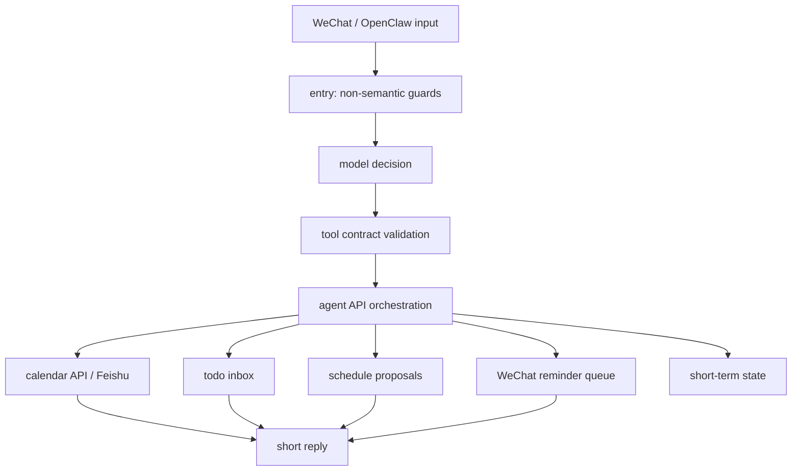

# Architecture

Navi Calendar is a self-hosted WeChat calendar assistant. The public architecture keeps one clear boundary: the model understands the user once, and deterministic tools perform every side effect.

## Boundaries

- `entry` handles only empty input, length, duplicate messages and runtime guards. It does not decide calendar semantics.
- `decision` is the only model interpretation layer.
- `tool-contract` validates every model-selected tool before execution.
- `agent-api` turns validated tool calls into controlled calendar, inbox, schedule, reminder and status operations.
- `calendar-api` is the side-effect boundary. The assistant can only say an event was created, updated or deleted after this layer succeeds.
- `seed-lite` stores unscheduled todo items separately from calendar events.
- `scheduler` proposes time slots but does not write calendar events until the user confirms.
- `settings` reads non-secret local JSON settings. Secrets stay in `.env`.

## Main Modules

- `src/entry`: request guards that do not inspect user intent.
- `src/decision`: model client and structured tool-call decision.
- `src/tool-contract`: schemas, validation and allowed tool names.
- `src/agent-api`: main assistant execution surface for WeChat / OpenClaw.
- `src/calendar-api`: deterministic calendar operations.
- `src/seed-lite`: todo inbox storage.
- `src/scheduler`: schedule candidate generation.
- `src/briefing`: daily briefings and workbench summaries.
- `src/wechat-reminder`: reminder queue and dispatch support.
- `src/settings` and `src/settings-summary`: public-safe configuration summaries.
- `src/status-overview`: read-only current pending-state overview.

## Runtime Configuration

Navi uses two configuration layers:

- `.env` for secrets and external service IDs.
- `config/settings.local.json` for non-secret product defaults.

The public repository includes `.env.example` and `config/settings.example.json` only.

## Public Release Boundary

The live development repository may contain private runbooks and planning records. Public GitHub releases should be generated from the clean export manifest, not by publishing the live repository history directly.
