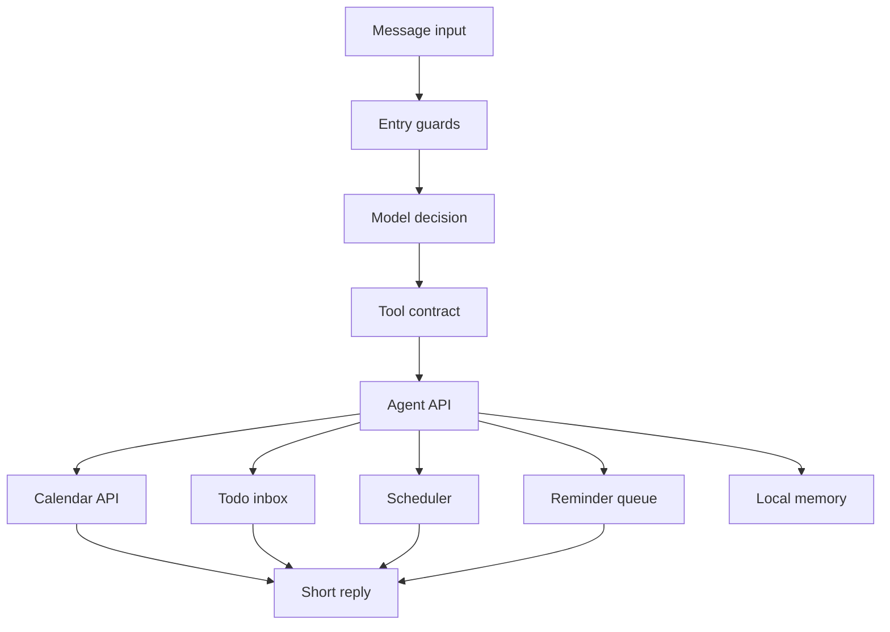

# Architecture

Navi Calendar follows a model-first, tool-controlled architecture. The model interprets a request once and selects a structured tool; deterministic modules validate and execute the action.



## Principles

- Entry guards only handle operational checks such as empty input, duplicate messages, length limits, and runtime configuration.
- The model is the only semantic decision layer.
- Tool contracts validate all model-selected actions before execution.
- Calendar writes, updates, and deletions are performed only by the calendar API.
- Schedule proposals, deletes, and conflict resolution require confirmation before final write actions.
- The todo inbox stores unscheduled items separately from calendar events.
- Local memory can provide schedule preferences, but it cannot write or move calendar events by itself.
- Secrets stay in `.env`; non-secret defaults stay in `config/settings.local.json`.

## Main Modules

- `src/entry`: operational request guards.
- `src/decision`: model client and structured decision interface.
- `src/tool-contract`: tool schemas and validation.
- `src/agent-api`: main assistant orchestration surface.
- `src/calendar-api`: deterministic calendar operations.
- `src/seed-lite`: lightweight todo inbox.
- `src/scheduler`: schedule proposal generation.
- `src/briefing`: daily briefings and workbench summaries.
- `src/wechat-reminder`: reminder queue support.
- `src/settings`: non-secret settings loader.
- `src/status-overview`: read-only pending-state overview.

## Configuration

```text
.env
  secrets and external service IDs

config/settings.local.json
  non-secret product defaults
```

The public repository includes only `.env.example` and `config/settings.example.json`.

## Public Release Boundary

Public releases should be generated with:

```bash
npm run public:export
npm run public:audit
```

Publish the generated `dist/public/navi-calendar` directory, not a private development workspace with local history and deployment notes.
